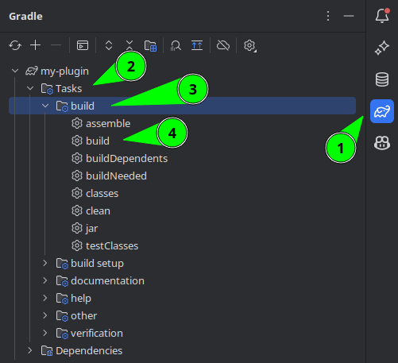

# Minecraft-Entwicklung mit Gradle: Grundlegend und fortgeschritten | Ein Leitfaden

[English Version](../posts/gradle_minecraft_basic_and_advanced.md)

In diesem Blogbeitrag geht es um die Entwicklung von Minecraft-Plugins für Paper- und Spigot-Server mit Gradle.
Die Minecraft-Community hat rund um das Build-Tool Gradle ein riesiges Ökosystem für Minecraft aufgebaut.
Anstatt dich mit einer Beispiel-Gradle-Datei zu überschütten, werden wir Schritt für Schritt vorgehen.
Wir beginnen mit dem grundlegenden Gradle-Layout, legen Repositories und Abhängigkeiten fest und fahren mit Plugins fort.

<!-- more -->

## Was ist Gradle?

Gradle ist ein sogenanntes Projektmanagementsystem oder auch Build-Tool.
Es kümmert sich im Wesentlichen um deinen Build-Prozess, löst Abhängigkeiten auf, führt Tests aus und kann alles Mögliche tun, sogar einen Minecraft-Server starten.
Gradle verwendet Kotlin oder Groovy für die Build-Datei.
Ich empfehle, Kotlin zu verwenden.
Wo du in Maven benutzerdefinierte Plugins brauchst, kannst du mit Gradle einfach deine eigene Logik direkt in die Build-Datei schreiben.
Aber genug der Beispiele, jetzt ist es Zeit, loszulegen.

## Gradle installieren

Wenn du Gradle noch nicht installiert hast, solltest du das zuerst tun.
Ich werde hier nicht näher darauf eingehen, da Gradle selbst eine gute [Dokumentation](https://gradle.org/install/) dazu hat.
Wir werden Gradle nur für die anfängliche Projektinitialisierung verwenden und danach mit dem Gradle-Wrapper fortfahren.

## Der Gradle-Wrapper

Der Gradle-Wrapper ist im Grunde eine portable Gradle-Installation.
Er benötigt keine Gradle-Installation auf dem System und kann überall zum Bauen verwendet werden.
Deshalb hat er seine eigene Version.
Um diese Version zu aktualisieren, brauchst du nur einen Befehl:

```shell
./gradlew wrapper --gradle-version=8.2.1 --distribution-type=bin
```

Das funktioniert auf Unix-Systemen und auch in der Windows PowerShell oder Git Bash.
Wenn du die Windows cmd verwendest, musst du stattdessen `gradlew.bat` benutzen.

Die neueste Version findest du auf der [Gradle-Website](https://gradle.org/releases/).

## Setting up a Gradle project

=== "Mit IntelliJ"

    

    Wir werden uns die Markierungen nacheinander ansehen.
    Die meisten Einstellungen sind bereits standardmäßig festgelegt.

    1. Wir wählen **New Project**.
    2. Wir fügen unsere Projekt-ID, auch bekannt als Name, hinzu.  
    Dieser Name ist dein **Plugin-Name in Kleinbuchstaben** mit einem "-" an der Stelle, an der sonst ein Leerzeichen stehen würde.  
    Aus "MyPlugin" wird also "my-plugin".
    3. Stelle sicher, dass ein **Git Repository** erstellt wird
    4. Wähle **Java** als Sprache oder **Kotlin**, wenn dir das besser gefällt, aber ich werde hier nur Java verwenden.
    5. Wähle **Gradle als Build-System**.
    6. Wähle **Kotlin als Gradle DSL** 
    7. Lass IntelliJ einen Beispielcode hinzufügen.  
    Dieser wird später entfernt, erstellt aber bereits die wichtigsten Verzeichnisse.
    8. Wähle den Wrapper als Gradle-Distribution aus
    9. Trage hier die neueste Gradle-Version ein, die auf der [Gradle Website](https://gradle.org/releases/) angegeben ist.  
    Es kann sein, dass diese nicht im Dropdown-Menü zur Auswahl steht, aber du kannst sie selbst eintragen.
    10. Gib hier deine Group ID ein.
    Wenn du nicht weißt, was du hier schreiben sollst, schau in meinem anderen [Beitrag](minecraft_main_class.md#1-namespace-konflikte) nach.
    Wenn du keine Domain besitzt, schaue [hier](minecraft_main_class.md#ich-habe-keine-domain)
    11. Dies ist derselbe wie dein Name in **2.**

=== "Mit Eclipse"

    Sorry, Nutzer von Eclipse.
    Es ist Zeit, eine wirklich gute IDE zu verwenden.
    Wechsle zu IntelliJ c:

=== "Mit CLI"

    Wenn du bereits ein Projekt hast, kannst du es ganz einfach über die Kommandozeile einrichten.
    Wenn dein Projekt bereits ein Maven-Projekt ist, bietet Gradle dir an, es in ein Gradle-Projekt umzuwandeln.

    Wir werden uns ansehen, wie wir ein neues Gradle-Projekt einrichten, ohne etwas aus Maven zu importieren.
    
    Zuerst beginnen wir mit der Initialisierung von Gradle mit `gradle init`.
    Wir verwenden dafür die installierte Gradle-Version, deshalb musst du sie installiert haben.
    
    Du erhältst dann diesen Dialog

    ```
    Select type of project to generate:
      1: basic
      2: application
      3: library
      4: Gradle plugin
    Enter selection (default: basic) [1..4]
    ```
    Wähle hier 1 aus, indem du einfach `1` eintippst oder die Eingabetaste drückst, da `basic` die Standardeinstellung ist.
    Damit wird ein einfaches Gradle-Projekt erstellt.

    Wenn du stattdessen eine Bibliothek erstellen willst, kannst du "3" wählen.
    Damit werden jedoch nur ein paar grundlegende Plugins angewendet, die wir später sowieso ausprobieren werden.
    
    
    Im nächsten Schritt müssen wir die Sprache für unsere Gradle-DSL auswählen
    ```
    Select build script DSL:
      1: Kotlin
      2: Groovy
    Enter selection (default: Kotlin) [1..2]
    ```
    Wähle hier erneut 1 aus, indem du `1` eingibst oder drücke einfach die Eingabetaste, da Kotlin die Standardeinstellung ist.

    Jetzt müssen wir unseren Projektnamen eingeben.
    Ich empfehle, den Namen deines Plugins klein zu schreiben und anstelle von Leerzeichen ein "-" einzufügen.
    So wird aus `MyPlugin` `my-plugin`.
    ```
    Project name (default: directory): 
    ```
    
    Als Nächstes haben wir eine Frage zu Gradle.
    ```
    Generate build using new APIs and behavior (some features may change in the next minor release)? (default: no) [yes, no] 
    ```
    Ich empfehle dir, die Standardeinstellung `no` zu wählen. Drücke also einfach die Eingabetaste oder gib `no` ein.
    Du bist fertig.


## Gradle-Dateien

Du hast jetzt einen ganzen Haufen neuer Dateien.
Gehen wir sie der Reihe nach durch.

### Gradle-Verzeichnis

Das Gradle-Verzeichnis enthält das Wrapper-Verzeichnis, das seinerseits die Datei `gradle-wrapper.jar` enthält, die dein Gradle-Wrapper ist.
Das ist, wie bereits erwähnt, deine portable Gradle-Installation.

Die `gradle-wrapper.properties` enthält die Einstellungen des Wrappers.
Der wichtigste Teil hier ist die Version.
Du kannst sie auch hier ändern, wenn du den Befehl aus dem vorherigen [Abschnitt](#der-gradle-wrapper) vergessen hast.

### build.gradle.kts

Die build.gradle.kts ist das Herzstück unseres Projekts.
Fast die gesamte Konfiguration unseres Projekts wird in dieser Datei vorgenommen.
Sie enthält Abhängigkeiten, Repositories und eine Menge anderer Dinge.

### gradlew und gradlew.bat

Das sind die Gradle-Wrapper-Dateien.

- `gradlew.bat` für Windows cmd
- `gradlew` für Unix-Systeme, Windows powershell und git bash auf Windows.

### settings.gradle.kts

Die settings.gradle.kts kann verwendet werden, um projektweite Einstellungen wie Plugin-Repositories (keine Dependency-Repositories!) anzuwenden.
Du kannst hier auch Untermodule definieren, wenn du ein Multimodul-Projekt hast oder einen [Versionskatalog](https://docs.gradle.org/current/userguide/platforms.html) erstellst.

### src directory

Auch wenn das Verzeichnis streng genommen kein Teil von Gradle ist, ist es dennoch wichtig, eine bestimmte Einrichtung zu haben:
```
.
└── src/
    ├── main/
    │   ├── java
    │   └── resources
    └── test/
        ├── java
        └── resources
```

Wenn diese Verzeichnisse nicht in deinem src-Verzeichnis vorhanden sind, erstelle sie bitte.

## Die grundlegende build.gradle.kts

Werfen wir zunächst einen Blick auf unsere build.gradle.kts.
Sie sollte im Moment noch leer sein, wenn du die Cli-Methode verwendet hast, oder sie enthält bereits einiges, wenn du sie über IntelliJ eingerichtet hast.

Fügen wir einige Abschnitte hinzu, um mit einer neuen Datei zu beginnen.

### Der Plugin-Abschnitt

Der oberste Abschnitt unserer Datei wird immer der Abschnitt "Plugins" sein.
Wir fangen also damit an, ihn zuerst einzufügen.

```java
plugins {
}
```

Die gesamte Gradle-Logik funktioniert, indem Plugins Tasks hinzufügen, die von uns ausgeführt werden.
Da wir eine Java-Anwendung erstellen wollen, müssen wir das `java`-Plugin hinzufügen.
Dazu schreiben wir einfach `java` in den `plugins`-Block.

```java
plugins {
    java
}
```

Und das war's. Damit sind wir mit der Einrichtung unseres Plugins vorerst fertig.

### Gruppe und Version deklarieren

Jetzt müssen wir unsere Gruppe und Version deklarieren.
Das ist kein Abschnitt, sondern nur zwei Werte, die wir zuweisen.
Deine Gruppenkennung sollte eine Domain sein, die du **besitzt**, und zwar in umgekehrter Reihenfolge, falls noch nicht geschehen.
Wenn du keine Domain besitzt, schau dir meinen anderen [Beitrag](minecraft_main_class.md#ich-habe-keine-domain) an.
Ich empfehle dir, [semver](https://dev.to/nialljoemaher/an-introduction-to-semantic-versioning-26n9) für deine Version zu verwenden.

```java
group = "dev.chojo"
version = "1.0.0-SNAPSHOT"
```

### Abschnitt Repositories

Im Abschnitt Repositories definieren wir die Repositories, in denen sich unsere Abhängigkeiten befinden.

Wahrscheinlich brauchen wir zwei Repositories.

- `mavenCentral()`   
  Dies ist das zentrale Maven-Repository, in dem sich die meisten Abhängigkeiten befinden, die wir benötigen.
  Wenn du Maven benutzt hast: Bei Maven musst du das nicht extra importieren, aber bei Gradle schon.
- `maven("https://repo.papermc.io/repository/Maven-public/")`  
  Dies importiert das Paper mc Repository. Natürlich kannst du das auch mit jedem anderen Repository machen.

```
repositories {
    MavenCentral()
    Maven("https://repo.papermc.io/repository/Maven-public/")
}
```

**Reihenfolge zählt!**

Die Reihenfolge, in der du die Repositories in diesem Abschnitt zuweist, ist die Reihenfolge, in der Gradle nach Abhängigkeiten sucht.
Es wird den ersten gefundenen Ort nehmen, an dem die Abhängigkeit vorhanden ist.

**Maven lokal**

Wenn du Abhängigkeiten aus deinem lokalen Maven-Repository verwenden willst, musst du am Anfang des Abschnitts `mavenLocal()` hinzufügen.
Ich empfehle dir, dies nur für die lokale Entwicklung zu tun, da dies die Möglichkeit, auf anderen Rechnern zu bauen, zunichte macht.

### Abschnitt Dependencies

!!! note "Anmerkung"
    
    Wenn du importe für JUnit hier hast kannst du diese erstmal löschen.

Im Abschnitt `dependencies` können wir zunächst zwei verschiedene Arten von Abhängigkeiten definieren:

```java
dependencies {
    compileOnly("io.papermc.paper:paper-api:1.20.1-R0.1-SNAPSHOT")
    implementation("de.chojo.sadu", "sadu", "1.3.1")
}
```

!!! note

    Sadu ist hier nur zu demonstrationszwecken und nicht zwingend benötigt

Ich habe hier zwei verschiedene Arten verwendet, um Abhängigkeiten zu deklarieren.
Beide sind gültig.
Du kannst sie entweder als einen String oder als drei separate Strings deklarieren.

[SADU](https://github.com/rainbowdashlabs/sadu) ist eine von mir geschriebene Library, die Anfängern den Umgang mit Datenbanken erleichtern soll. Schau mal rein c:

=== "Als implementation"

    Die `implementation`-Importe sind Abhängigkeiten, die nicht Teil von Paper sind und daher auf irgendeine Weise in dein Plugin gelangen müssen.
    Das wird jetzt nicht funktionieren, aber wir werden das in einem späteren Schritt beheben.

=== "Als compileOnly"

    Die `compileOnly`-Importe sind Abhängigkeiten, die wir nur zum Bauen brauchen, aber bereits auf dem Server sind.
    Das wird fast immer nur Paper für dich sein.

### Abschnitt Tasks

!!! note

    Du kannst alles löschen, was sich in deinen Tasks befindet    

Ich habe dir bereits gesagt, dass alles in Gradle mit Tasks funktioniert.
Es muss also eine Möglichkeit geben, sie zu konfigurieren, und dafür gibt es den Abschnitt `tasks`.
Für den Moment fangen wir einfach mit einem leeren Abschnitt an.

```java
tasks {

}
```

## Java konfigurieren

Jetzt, da wir alle erforderlichen Abschnitte in unserer Datei haben, können wir endlich damit beginnen, unser Projekt zu konfigurieren.

Das erste, was wir konfigurieren müssen, ist das `java`-Plugin, das wir bereits importiert haben.
Ich habe dir zwar schon die grundlegenden Abschnitte gezeigt, aber es gibt noch mehr, denn fast jedes Plugin fügt einen eigenen Abschnitt zur Konfiguration hinzu.
Das heißt, wir können nicht nur die Aufgaben unserer Plugins konfigurieren, sondern auch das Plugin selbst.

```java
java {
    toolchain {
        languageVersion.set(JavaLanguageVersion.of(17))
    }
    withSourcesJar()
    withJavadocJar()
}
```

Für `java` stellen wir die so genannte Toolchain ein.
Die Toolchain bestimmt, welche Java-Version in unserem Projekt verwendet wird.
Wenn du eine Dependency importieren willst, die mit Java 17 kompiliert wurde, musst du deine Toolchain ebenfalls auf 17 setzen.
Wenn du hingegen eine Toolchain mit Java 17 verwendest, kannst du immer noch jede Abhängigkeit mit einer älteren Java-Version importieren.

Wir legen auch fest, dass wir ein Source-Jar und ein Javadoc-Jar erstellen wollen.
Das ist für uns jetzt vielleicht noch nicht wichtig, aber in Zukunft vielleicht schon.
Letztendlich schadet es nicht, sie zu haben.

Zusätzlich zu unserer Java-Plugin-Konfiguration wollen wir auch die Tasks des Plugins konfigurieren.
Es gibt drei Tasks, die für uns interessant sind:

=== "compileJava"

    Dieser Task kümmert sich um die Kompilierung unseres Java-Codes

=== "compileJavaTest"

    Dieser Task kümmert sich um die Kompilierung unseres in Java geschriebenen Testcodes.
    Auch wenn wir noch keine Tests haben, kann es nicht schaden, sie trotzdem zu definieren.

=== "javadoc"

    Dieser Task kümmert sich darum, wie unsere Javadocs erstellt werden.

Alles, was wir für diese Tasks definieren wollen, ist, dass wir als Encoding `UTF-8` verwenden wollen.
Dadurch werden seltsame Zeichen bei der Verwendung von Sonderzeichen vermieden.

```java
tasks {
    compileJava {
        options.encoding = "UTF-8"
    }

    compileTestJava {
        options.encoding = "UTF-8"
    }

    javadoc {
        options.encoding = "UTF-8"
    }
}
```

Und das ist die Konfiguration für unser Java-Plugin.

## Das Plugin bauen

Jetzt kann uns nichts mehr daran hindern, unser Plugin zu bauen.
Alles, was uns noch fehlt, ist eine `plugin.yml`.
Wir könnten hier aufhören und uns einfach freuen, dass es funktioniert, aber es gibt noch viel (und damit meine ich VIEL) Raum für Verbesserungen.
Wir müssen auch noch das Problem lösen, dass unsere Bibliothek nicht enthalten ist, die wir zuvor mit `implementation` importiert haben.
Du könntest jetzt aufhören, aber ich empfehle dir, weiterzulesen!

Für den Moment zeige ich dir nur die beiden Möglichkeiten, einen Gradle-Task auszuführen.

!!! Hinweis

    Du kannst damit nicht nur den Build Task ausführen, sondern auch **jeden anderen Task**.
    Wenn du IntelliJ verwendest, kannst du dir die anderen Tasks ansehen, die verfügbar sind.

=== "Über cli"

    Gehe in deine Cli und führe `./gradlew build` oder `gradlew.bat build` aus, je nachdem, welches Betriebssystem du hast

=== "Über IntelliJ"

    Öffne das Gradle-Fenster auf der rechten Seite. Gehe zu Tasks -> build und führe den `build` Task aus, indem du darauf klickst.

    

### Erhalte dein Build

Du findest dein Plugin jetzt unter `build/libs/myplugin.jar`.
Jetzt ist es natürlich noch nicht auf deinem Server, aber dafür gibt es eine sehr einfache Möglichkeit.

## Jar nach dem Build kopieren

!!! warning

    Stattdessen kannst du auch direkt einen Paper Server mit deinem Plugin starten.
    Wirf einen Blick auf den Abschnitt [Server ausführen](#starte-den-server-mit-deiner-jar)

Um unser jar auf unseren Server zu kopieren, können wir einfach einen eigenen Task erstellen.

Wirf einen Blick auf den Code. Erklärungen werden angezeigt, wenn du mit dem Mauszeiger über das Plus für jede Zeile fährst

!!! Hinweis

    Auch wenn ich im Moment keine anderen Tasks in meinem tasks Abschnitt habe, heißt das nicht, dass du einen neuen Tasks Abschnitt erstellen solltest.
    Ich zeige nur nicht jedes Mal alle vorhandenen Tasks, um es so kurz wie möglich zu halten.

```java
tasks {
    /*(1)!*/register<Copy>("copyToServer") {
        /*(2)!*/val props = Properties() 
        /*(3)!*/val propFile = file("build.properties") 
        /*(4)!*/if (!propFile.exists()) propFile.createNewFile() 
        /*(5)!*/file("build.properties").reader().let { props.load(it) }
        /*(6)!*/val path = props.getProperty("targetDir") ?: "" 
        /*(7)!*/if (path.isEmpty()) throw RuntimeException("targetDir is not set in build.properties") 
        /*(8)!*/from(jar) 
        /*(9)!*/destinationDir = File(path)
    }
}
```

1. Wir registrieren einen neuen Task vom Typ `Copy` und nennen ihn `copyToServer`.
2. Wir erstellen unsere Properties  
   Du musst eventuell einen Import `import java.util.*` am Anfang der Datei hinzufügen.
3. Wir definieren eine Datei namens `build.properties`.
4. Wir erstellen die Datei, wenn sie noch nicht existiert.
5. Wir lesen die Datei und fügen sie zu den Properties hinzu.
6. Wir lesen die Property `targetDir`.
7. Wir prüfen, ob der Pfad leer ist und geben einen Fehler aus, wenn dies der Fall ist
8. Wir legen fest, dass die Ausgabe unseres `jar`-Tasks kopiert werden soll
9. Wir legen das Zielverzeichnis des Tasks `Copy` fest

## Erstellen einer plugin.yml mit einem Gradle-Plugin

Du hast es vielleicht schon ausprobiert oder auch nicht.
Wenn du bereits eine `plugin.yml` erstellt hast, kann es sein, dass es funktioniert hat und sonst nicht.

Wenn du bereits eine `plugin.yml` erstellt hast, kannst du sie jetzt wieder löschen oder bis zum Ende des Abschnitts warten.

Um unsere `plugin.yml` zu erstellen, werden wir das `plugin-yml` [Gradle plugin by minecrell](https://github.com/Minecrell/plugin-yml) verwenden.

### Importieren


Zuerst müssen wir es importieren. Die aktuellste Version steht oben. 

!!! Hinweis

    Obwohl ich im Moment keine anderen Plugins in meinem Plugin-Abschnitt habe, heißt das nicht, dass du einen neuen Plugin-Abschnitt erstellen oder die anderen Plugins löschen solltest.
    Ich zeige nur nicht jedes Mal alle vorhandenen Plugins, um es so kurz wie möglich zu halten.

```java
plugins {
  id("net.minecrell.plugin-yml.bukkit") version "version" // (1)!
}
```

1. Ersetze die Version hier durch die Version im Bild oben

### Konfiguration

Nachdem das erledigt ist, müssen wir unser Plugin konfigurieren.
Das tun wir natürlich in dem Abschnitt des Plugins, der in unserem Fall `bukkit` heißt.

```java
bukkit {
    name = "MyPlugin"
    main = "dev.chojo.myplugin.MyPlugin"

    commands {
        register("test") {
            aliases = listOf("command")
        }
    }
}
```

Dies ist die minimale Einrichtung. (Befehle sind nicht erforderlich)
Was machen wir hier?

1. Wir definieren das Plugin mit dem Namen "MyPlugin".
2. Wir definieren unsere Plugin-Klasse.  
   Bitte nenne sie nicht `Main` und wähle einen korrekten Namespace.
   Siehe meinen vorherigen [Blogbeitrag](minecraft_main_class.md).
3. Wir registrieren einen Befehl namens `test` mit dem Alias `command`.

Weitere Referenzen findest du auf der [GitHub-Seite](https://github.com/Minecrell/plugin-yml#bukkit)

Die Version wird standardmäßig aus deiner Projektversion gelesen.

### Bukkit Libraries - Die bessere Alternative zu Shading

Du erinnerst dich wahrscheinlich daran, dass unser Abschnitt mit den Abhängigkeiten so aussah:

```java
dependencies {
    compileOnly("io.papermc.paper:paper-api:1.20.1-R0.1-SNAPSHOT")
    implementation("de.chojo.sadu", "sadu", "1.3.1")
}
```

Bisher hatten wir das Problem, dass SADU nicht in unserem jar enthalten war.
Wenn wir das Plugin `plugin-yml` verwenden und Minecraft 1.16.5 oder höher einsetzen, können wir den Library Loader nutzen.
Dazu müssen wir nur `implementation` in `bukkitLibrary` ändern:

```java
dependencies {
    compileOnly("io.papermc.paper:paper-api:1.20.1-R0.1-SNAPSHOT")
    bukkitLibrary("de.chojo.sadu", "sadu", "1.3.1")
}
```

Jetzt wird unsere Bibliothek von Spigot/Paper geladen, wenn es unser Plugin lädt, und ist während der Laufzeit verfügbar.
Das funktioniert, weil sich SADU im Maven Central befindet und Spigot/Paper die Bibliotheken von dort herunterlädt.
Bibliotheken, die sich nicht im Maven Central befinden, müssen trotzdem geshaded werden.

#### Paper-Plugins

Paper-Plugins sind eine Art von Plugins, die es nur für Paper-Server gibt.
Sie sind sehr experimentell.
Außerdem fehlt ihnen eine eingebaute Lösung für Befehle und Konfigurationsdateien.
Wenn du ein Anfänger bist, empfehle ich dir dringend, sie nicht zu benutzen.

Du kannst mit Paper-Plugins auch Abhängigkeiten aus benutzerdefinierten Repositories laden. Lies mehr darüber [hier](https://github.com/Minecrell/plugin-yml#plugin-libraries-json).

Mehr über Paper Plugins findest du [hier](https://docs.papermc.io/paper/reference/paper-plugins) und [hier](https://docs.papermc.io/paper/dev/getting-started/paper-plugins)


## Abhängigkeiten in unser Jar shaden


Nehmen wir an, SADU befindet sich nicht im Maven Central und wir können den Library Loader nicht verwenden.

In diesem Fall müssen wir ein anderes Plugin namens shadow verwenden. Die aktuellste Version steht oben

### Importieren

```java
plugins {
  id("com.github.johnrengelman.shadow") version "version" // (1)!
}
```

1. Ersetze die Version hier durch die Version im Bild oben

Unsere Abhängigkeiten sehen erneut wie folgt aus:

```java
dependencies {
    compileOnly("io.papermc.paper:paper-api:1.20.1-R0.1-SNAPSHOT")
    implementation("de.chojo.sadu", "sadu", "1.3.1")
}
```

Der Zweck von shadow ist es, alles, was als `implementation` markiert ist, in die Ausgabedatei zu kopieren.

Das ist bereits der Fall, wenn wir den Task `shadowJar` anstelle des Tasks `build` ausführen würden.
Wenn wir unser Plugin jedoch ohne `shadowJar` und nur mit `build` bauen würden, wäre das Ergebnis ein Jar, das einfach kaputt ist.

### Konfiguration

Wir können das Problem lösen, indem wir Gradle mitteilen, dass wir beim Ausführen von `build` eigentlich `shadowJar` ausführen wollen.
Dazu konfigurieren wir den Task `build` so, dass er von `shadowJar` abhängt.

```java
tasks {
    build {
        dependsOn(shadowJar)
    }
}
```

#### Verschiebung

Jetzt, wo unsere Bibliotheken geshadet sind, müssen wir etwas tun, das wir Relocation nennen.
Das ist wichtig, um Konflikte mit anderen Plugins zu vermeiden, wenn du dieselbe Bibliothek shadest.
Dazu müssen wir es konfigurieren, aber dieses Mal konfigurieren wir nicht das Plugin, sondern den Task namens `shadowJar`.

```java
tasks {
    shadowJar {
        val mapping = mapOf("de.chojo.sadu" to "sadu")
        val base = "dev.chojo.myplugin.libs."
        for ((pattern, name) in mapping) relocate(pattern, "${base}${name}")
    }
}
```

Das bedeutet im Wesentlichen Folgendes:

1. Wir definieren eine Map mit den Packages, die wir verschieben wollen, und dem Verzeichnis, in das sie verschoben werden sollen.
2. Wir definieren die Basis des neuen Standorts für alle geshadeten Bibliotheken.
3. Für jeden Eintrag in unserer Map rufen wir die relocation Funktion unseres Tasks auf.

Was macht die Relocation-Funktion also?  
Betrachte die Klasse `de.chojo.sadu.Sadu`. Nach der Verschiebung befindet sie sich unter `dev.chojo.myplugin.libs.sadu.Sadu`.
Da es nun in deinem Namespace und deinem Plugin liegt, kann es nicht mehr mit anderen Plugins kollidieren.
Shadow ersetzt außerdem alle Pfade zu der Klasse in deinem Code durch den neuen, verschobenen Pfad.

#### Verwendung der Ausgabe in copy

!!! warning

    Stattdessen kannst du auch direkt einen Paper Server mit deinem Plugin starten.
    Wirf einen Blick auf den Abschnitt [Server ausführen](#starte-den-server-mit-deiner-jar)

Um die Ausgabe von `shadowJar` für unseren copy Task zu verwenden, musst du nur den `jar` Task in den `shadowJar` Task ändern.

```java
tasks {
    register<Copy>("copyToServer") {
        val props = Properties() 
        val propFile = file("build.properties") 
        if (!propFile.exists()) propFile.createNewFile() 
        file("build.properties").reader().let { props.load(it) }
        val path = props.getProperty("targetDir") ?: "" 
        if (path.isEmpty()) throw RuntimeException("targetDir is not set in build.properties") 
        /*(1)!*/from(shadowJar) 
        destinationDir = File(path)
    }
}
```

1. Ändere es hier

## NMS und internals mit Paperweight Userdev


Ich rate davon ab, nms in irgendeiner Weise zu verwenden, aber wenn du das möchtest, solltest du das `userdev` Plugin von `paperweight` benutzen.
Damit kannst du in einer Umgebung mit unverschleierten Namen entwickeln.
Es ist auch die einzige unterstützte Möglichkeit, auf die Interna von `org.bukkit.craftbukkit.v1_XX_RX` zuzugreifen.
Es stellt auch sicher, dass du beim Upgrade auf eine neue Version keinen Code ändern musst, der das Paket `net.minecraft` verwendet.
Natürlich musst du trotzdem Code ändern, wenn Mojang etwas geändert hat.
Du musst auch immer noch die Paketnamen ändern, wenn du internen Code aus `org.bukkit.craftbukkit.v1_XX_RX` verwendest;

### Hinzufügen des Repositorys

Dafür müssen wir etwas Neues machen und in unserer `settings.gradle.kts` ein Plugin-Repository hinzufügen.

```java
pluginManagement {
    repositories {
        gradlePluginPortal()
        Maven("https://papermc.io/repo/repository/Maven-public/")
    }
}
```

Dazu müssen wir den Abschnitt `pluginManagement` konfigurieren und die Repositories ändern.
Standardmäßig wird nur das `gradlePluginPortal()` importiert, das normalerweise alle wichtigen Plugins enthält.
Aber wir wollen jetzt ein weiteres Repository hinzufügen.
Es ist sehr wichtig, dass du sowohl `gradlePluginPortal()` als auch das Paper-Repository hinzufügst.

### Importieren

Jetzt können wir das Plugin in unsere Datei `build.gradle.kts` importieren. Die aktuelle version steht oben.

```java
plugins {
    id("io.papermc.paperweight.userdev") version "version"
}
```

Damit fehlt nur noch ein Schritt und das ist das Einstellen der Papierversion

### Konfiguration

Um die Version zu definieren, die wir verwenden wollen, müssen wir sie zu unseren Abhängigkeiten hinzufügen.
Dazu müssen wir die alte Paper `compileOnly`-Dependency entfernen und durch die Paperweight-Dependency ersetzen.

```java
dependencies {
    paperweight.paperDevBundle("1.20.1-R0.1-SNAPSHOT")
}
```

Die Version, die du hier eingibst, ist die gleiche, die du vorher für Paper verwendet hast. Du entfernst nur die Group und die Artifact-ID.
Paper verwendet eine obfuscated Jar-Datei.
Das bedeutet, dass wir unsere Jar-Datei vor dem Erstellen neu onfuscaten müssen.
Das können wir tun, indem wir erneut einen Task konfigurieren.
Diesmal konfigurieren wir den Task `assemble` und setzen dort ein `dependsOn` auf unseren reobfuscation Task.

```java
tasks {
    assemble {
        dependsOn(reobfJar)
    }
}
```

!!! note

    Paper plant, in Zukunft ein nicht-obfuscated jar für Server zu verwenden.
    Damit wird dieser Schritt überflüssig.


Und das war's.
Jetzt kannst du nms so bequem wie möglich benutzen.

## Starte einen Server mit deiner Jar

Um dein Plugin schnell zu testen, kannst du direkt einen Server starten.
Du musst dazu nur das [run-task plugin](https://github.com/jpenilla/run-task) zu deiner Build-Datei hinzufügen.

Ich verzichte darauf, die Readme hierher zu kopieren, da ich ihr keinen weiteren Informationen hinzufügen kann.

## Vielen Dank!

Danke, dass du mir bis hierher gefolgt bist.
Du hast jetzt ein sehr gutes Verständnis für die Minecraft-Entwicklung mit Gradle.
