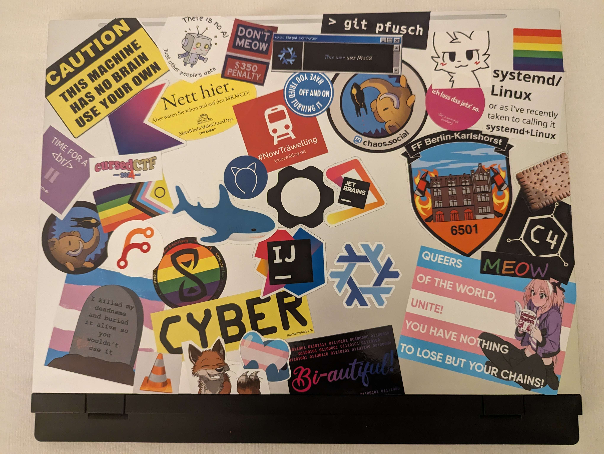

# GPN22 Tag 4 | Das Ende und der Anfang

Der letzte Tag der GPN beginnt wieder früh um halb neun. Obwohl ich super Müde bin, steht jetzt schon fest: Ich komme wieder und hoffentlich wird das der Anfang einer neuen jährlichen Tradition.

<!-- more -->
Eigentlich wollte ich ausschlafen und es langsam angehen lassen, aber natürlich war um 10 Uhr doch noch ein Talk, den ich sehen wollte. Es ging um "Big Data Analysis with SQL". Vermutlich hatte ich aber zu hohe erwartungen an den Talk. Die erste hälfte des Talks war lediglich basic SQL Erklärung, auf die ich gut hätte Verzichten können. Der zweite Part fühlte sich mehr an wie Technologiebingo. Eine Menge namen und Beispiele und zum Schluss noch ein grobes Architektur Diagram. Der Kern des ganzen ging auch eher um statische Aggregation und Statistiken, wofür ich keine wirkliche verwendung habe.

Also wieder zurück zum Platz. Die zwei Jungs von den letzten zwei Tagen waren auch schon wieder da. Nach einiger Zeit gesellte sich Nick wieder hinzu und auch Hannes und Johnny stießen recht schnell wieder hinzu. Irgendwann stellte sich dann noch heraus, dass einer der beiden Jungs sogar bereits auf dem DevCord war und so gar es eine neue Verbindung und wir werden vermutlich auch nach der GPN noch Kontakt halten. Nach ein paar letzten Stunden die viel zu schnell bei Gesprächen und programmieren vorbeigingen, war es dann auch so weit.

Als ob jemand einen Hebel umgelegt hatte, schwing alles um auf Abbau. wir schlossen und dem nach einiger Zeit auch an, machten unsere Tische leer und halfen auch noch ein bisschen Tragen. Da Nick jedoch auch bald zum Zug musste und sich bei uns allgemein der Hunger langsam bemerkbar machte, ging es kurz zum Hotel damit ich etwas Zeug loswerden konnte. Nick verabschiedete sich und unsere nun recht kleine Truppe auf Johnny, Hannes und mir beschloss mich in das Oxford mitzunehmen. Einem Ort, von dem ich zumindest bereits gehört hatte und der angeblich recht gute Burger anbieten sollte.

Nach einer recht kurzen fahrt und einem kleinen Spaziergang waren wir auch schon in einem recht schönen Pub. Ich struggelte wie immer an einer entscheidung, was ich essen und trinken sollte. Am Ende viel die Entscheidung natürlich auf einen Burger und ein schönes alkoholfreies Paulaner. So ließen wir die GPN gemütlich ausklingen bei einem letzten Gespräch, bevor sich dann auch Hannes verabschiedete.

Ich hatte jedoch noch Lust auf ein bisschen Kuchen und Johnny zeigte mir noch das "intro", das sich schöner Weise praktisch um die Ecke befand. So gönnten wir uns noch einen Cappuccino und ich mir einen echt leckeren Cheesecake. Nach einiger Zeit war es jedoch auch hier Zeit erneut Abschied zu nehmen.

Ich setzte mir meine Kopfhörer auf und trat zu "Born this way" als Nightcore version meinen Rückweg an zur Tram Station. Und vermutlich gibt dieses Lied auch eine gute Stimmung der GPN wieder. So viele Bunte und unterschiedliche Menschen auf einem Haufen. Jede:r konnte so sein wie man sich fühlte und wer man sein wollte. An wenigen Orten fühlte ich mich tatsächlich so frei persönlich wie auf der GPN. Tatsächlich ein wirklicher Safespace für so viele. In einem Talk wurde auch erwähnt, dass die GPN die vermutlich diverseste Veranstaltung im CCC ist. Ohne je auf einem anderen CCC Event gewesen zu sein, glaube ich das gerne und finde es wundervoll.

Beim Schreiben dieses Posts und dem Blick zurück auf das Wochenende kommt tatsächlich auch ein Tränchen. Ich bin glücklich, dass ich dabei war, aber definitiv auch traurig, dass es schon vorbei ist. Die vier Tage gingen super schnell vorbei. Wenn ich aber so in mich hinein fühle, hätte ich vermutlich keinen 5. Tag mehr mitgemacht. Ich bin müde und meine Social Battery war schon lange nicht mehr so leer wie sie gerade ist.

Mein Framework hat mittlerweile kaum mehr einen freien Platz und ich liebe einfach wie das geendet ist. Es wird mich immer an dieses schöne Wochenende erinnern.
{ width="800" }

Natürlich wäre die ganze GPN nichts ohne Entropia und die ganzen Trolle die überall geholfen haben. Für mich ist klar, dass ich nächstes Jahr definitiv auch Trollen möchte um etwas zurückzugeben.

Jetzt sitze ich in meinem Hotel und werde den Abend noch schön ausklingen lassen. Vielleicht etwas serie schauen, wenn das Internet mitmacht oder vielleicht noch etwas mit meinen Katzenohren durch die Stadt laufen und Musik hören. Aber egal wie ich mich entscheide, eins ist klar. Ich komme nächstes Jahr wieder und ich kann es kaum erwarten.
