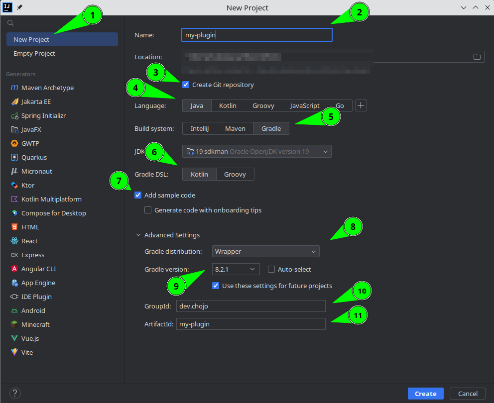

# Minecraft Development with Gradle: Basic and Advanced | A guide

[German Version](../de/gradle_minecraft_basic_and_advanced.md)

This blog post is about developing Minecraft plugins for Paper and Spigot servers using Gradle.
The Minecraft community has built a huge ecosystem for Minecraft around the Gradle build tool.
Instead of throwing a sample Gradle file at you, we will go through this step by step.
We will start with the basic Gradle layout, set up repositories and dependencies, and move on to plugins.
<!-- more -->

## What is Gradle?

Gradle is a project management system or build tool.
It basically takes care of your build process, resolves dependencies, runs tests and can do all sorts of things, even start a Minecraft server.
Gradle uses Kotlin or Groovy for the build file.
I recommend using Kotlin.
Where you need custom plugins in maven, you can simply write your own logic directly into the build file when using Gradle.
But enough of examples, time to get started.

## Install Gradle

If you haven't already installed Gradle, you should do so first.
I will not go into detail on this as Gradle itself has great [documentation](https://gradle.org/install/) on this.
We will only use Gradle to initialise the project, and then use the Gradle wrapper.

## The Gradle wrapper

The Gradle wrapper is essentially a portable Gradle installation.
It does not require a Gradle installation on the system and can be used to build anywhere.
This is why it has its own version.
To update this version you only need one command:

```shell
./gradlew wrapper --gradle-version=8.2.1 --distribution-type=bin
```

This works on Unix systems as well as in Windows PowerShell or git bash.
If you are using windows cmd, you will need to use `gradlew.bat` instead.

Check the [Gradle website](https://gradle.org/releases/) for the latest version.

## Setting up a Gradle project

=== "Using IntelliJ"

    
    
    We will look at the marks one after another. 
    Most of the settings will be set by default already.
    
    1. We select **New Project**
    2. We add our project id aka name.  
    This name is your **plugin name in lower case** with `-` where a space would be.  
    So `MyPlugin` becomes `my-plugin`
    3. Make sure that a **git repository** will be created
    4. Select **Java** as language or **Kotlin** if you like this more, but I will only use Java here.
    5. Select **Gradle as build system**
    6. Select **Kotlin as Gradle DSL** 
    7. Let intellij add some sample code.  
    This will be removed later, but will create the most important directories.
    8. Select the wrapper as your Gradle distribution
    9. Enter the latest Gradle version, as mentioned on the [Gradle website](https://gradle.org/releases/).  
    This may not be available to select in the drop down menu, but you can enter it yourself.
    10. Enter your group id here.
    If you don't know what to write here have a log at my other [post](minecraft_main_class.md#1-namespace-conflicts)
    If you don't have a domain, see [here](minecraft_main_class.md#i-dont-have-a-domain)
    11. This is the same as your name in **2.**

=== "Using Eclipse"

    Sorry Eclipse users.
    Time to use an actually good IDE.
    Switch to IntelliJ c:

=== "Using CLI"

    If you already have a project, you can easily set it up from the command line.
    If your project is currently a Maven project, Gradle will offer to convert it to a Gradle project.

    We will look at how to set up a new Gradle project without importing anything from Maven.
    
    First we start by initialising Gradle with `Gradle init`.
    We're using the installed version of Gradle for this, so you need to have it installed.
    
    You will end up with this dialogue
    ```
    Select type of project to generate:
      1: basic
      2: application
      3: library
      4: Gradle plugin
    Enter selection (default: basic) [1..4]
    ```
    Choose 1 here by simply typing `1`, or just hit enter since `basic` is the default.
    This will create a basic Gradle project.

    If you want to create a library instead, you can choose `3`.
    However, all this does is to apply some basic plugins beforehand, which we will get through later anyway.
    
    
    The next step is to select the language for our Gradle DSL
    ```
    Select build script DSL:
      1: Kotlin
      2: Groovy
    Enter selection (default: Kotlin) [1..2]
    ```
    Again, choose 1 by typing `1` or just hit enter since Kotlin is the default.

    Now we need to enter our project name.
    I recommend using your plugin name in lower case and adding `-` where there would be spaces.
    So `MyPlugin` becomes `my-plugin`.
    ```
    Project name (default: directory): 
    ```

    Next is a question about Gradle stuff.    
    ```
    Generate build using new APIs and behavior (some features may change in the next minor release)? (default: no) [yes, no] 
    ```
    I recommend using the default no. So just press enter or type `no`.
    And you're done.

## Gradle files

Now you have a bunch of new files.
Let's go through them one by one.

### Gradle directory

The Gradle directory contains the wrapper directory, which in turn contains a `gradle-wrapper.jar', which is your Gradle wrapper.
This is your portable Gradle installation as mentioned earlier.

The `gradle-wrapper.properties` contains the settings of the wrapper.
The most important part is the version.
You can also change it here if you forgot to use the command shown in the previous [section](#the-gradle-wrapper).

### build.gradle.kts

The build.gradle.kts is the heart of our project.
Almost all the configuration of our project is done in this file.
It contains dependencies, repositories and lots of other stuff.

### gradlew and gradlew.bat

These are the Gradle wrapper files.

- `gradlew` for Unix systems, Windows powershell and git bash on Windows.
- `gradlew.bat` for the windows cmd

### settings.gradle.kts

The settings can be used to apply project wide settings such as plugin repositories (not dependency repositories!).
You can also define submodules here if you have a multi-module project, or create a [version catalogue](https://docs.gradle.org/current/userguide/platforms.html).

### src directory

While this directory is not strictly seen as part of Gradle, it is still important to have a specific structure:

```
.
└── src/
    ├── main/
    │   ├── java
    │   └── resources
    └── test/
        ├── java
        └── resources
```

If these directories do not exist in your src directory, please create them.

## The basic build.gradle.kts

Let's start by taking a look at our build.gradle.kts.
It should be empty at the moment if you used the cli approach, or already have some stuff in it if you set it up using IntelliJ.

Let's get you on the same page by adding some sections to start with a fresh file.

### The plugin section

The top section of our file will always be the `plugins' section.
So we start by adding it first.

```java
plugins {
}
```

The whole logic of Gradle is that plugins add tasks that we execute.
Since we want to build a Java application, we need to add the `java` plugin.
This can be done by simply adding `java` to the `plugins` block.

```java
plugins {
    java
}
```

And that's it. We are done with our plugin setup for now.

### Declare group and version

Now we need to declare our group and version.
This is not a section, just two values we assign.
Your group id, if not already set, should be a domain you **own** in reverse order.
If you don't have a domain, see my other [post](minecraft_main_class.md#i-dont-have-a-domain).
I recommend using [semantic versioning (semver)](https://dev.to/nialljoemaher/an-introduction-to-semantic-versioning-26n9) for your version.

```java
group = "dev.chojo"
version = "1.0.0-SNAPSHOT"
```

### Repositories section

The repositories section is where we define which repositories our dependencies will be in.

We will most likely need two repositories.

- `mavenCentral()`   
  This is the Maven Central repository where most of the dependencies we will need are located.
  If you have been using Maven: With Maven you did not need to import this specifically, but with Gradle you will need to do so.
- `maven("https://repo.papermc.io/repository/maven-public/")`  
  This will import the `paper-mc` repository. Of course you can do the same with any other repository.

```
repositories {
    mavenCentral()
    maven("https://repo.papermc.io/repository/maven-public/")
}
```

**Order is important!**

The order in which you assign repositories in this section is the order in which Gradle will search for dependencies.
It will take the first found location where the dependency exists.

**Maven local**.

If you want to use dependencies from your local Maven repository, you need to add `mavenLocal()` at the top of the section.
I strongly recommend doing this **only for local development**, as it destroys the ability to build on other machines.

### Dependencies section

!!! note

    If you have test imports from junit here, you can delete them for now.

Inside the dependencies section, we can define two different dependency types for now:

```java
dependencies {
    compileOnly("io.papermc.paper:paper-api:1.20.1-R0.1-SNAPSHOT")
    implementation("de.chojo.sadu", "sadu", "1.3.1")
}
```

!!! note

    SADU is here only for demonstration purposes and not mandatory required

I have used two different ways of declaring dependencies here.
Both are valid.
You can either declare them as one string or as three separate strings.

[SADU](https://github.com/rainbowdashlabs/sadu) is a library I wrote to make using databases easier for beginners. Have a look at it c:

=== "As implementation"

    The `implementation` imports are dependencies that are not part Paper, and therefore need to get into your plugin somehow.
    This will not work now, but we will fix this in a later step.

=== "As compileOnly"

    The `compileOnly` imports are dependencies that we only need to build our project, but are either not needed to run it, or are provided in some other way.
    This means that dependencies like Paper, FAWE, LuckPerms and in general any other api by other plugins will be imported as `compileOnly`.
    APIs that are not available as plugins on the server, which can be the case for Inventory APIs for example, must of course be imported as an `implementation`.

### Tasks section

!!! note

    You can delete anything currently in your tasks section    

I told you earlier that everything in Gradle works with tasks.
So there has to be a way to configure them, and this is where the tasks section comes in.
For now we will just start with a simple empty section.

```java
tasks {

}
```

## Configuring Java

Now that we have all the necessary sections in our file, we can finally start configuring our project.

The first thing we need to configure is the `java` plugin, which we have already imported.
While I have shown you the basic sections, there are more, as almost every plugin adds its own section for configuration.
This means that we can not only configure the tasks of our plugins, but also the plugin itself.

```java
java {
    toolchain {
        languageVersion.set(JavaLanguageVersion.of(17))
    }
    withSourcesJar()
    withJavadocJar()
}
```

For `java` we set the so-called toolchain.
The toolchain controls the version of java used in our project.
If you want to import a dependency compiled with java 17, you need to set your toolchain to 17 as well.
On the other hand, using a java 17 toolchain will still allow you to import any dependency using an older version of java.

We also define that we want to build a source jar and a javadoc jar.
This may not be important to us now, but it may be in the future.
It doesn't hurt to have it in the end.

In addition to configuring our java plugin, we also want to configure its tasks.
There are three tasks of interest to us:

=== "compileJava"

    This task is responsible for compiling our Java code.

=== "compileJavaTest"

    This task handles the compilation of our test code written in Java.
    Although we do not have any tests yet, it cannot hurt to define them anyway.

=== "javadoc"

    This handles how our javadocs are built.

All we want to define for these tasks is that we want to use `UTF-8` encoding for them.
This will avoid weird characters when using special characters.

```java
tasks {
    compileJava {
        options.encoding = "UTF-8"
    }

    compileTestJava {
        options.encoding = "UTF-8"
    }

    javadoc {
        options.encoding = "UTF-8"
    }
}
```

And that's the configuration for our Java plugin.

## Building the plugin

There is nothing stopping us from building our plugin now.
All we need is a `plugin.yml`.
While we could stop here and just be happy that it works, there is still a lot (and by that I mean A LOT) of room for improvement.
We also still have to fix the problem of not including our library that we previously imported with `implementation`.
So while you might be tempted to call it a day, I highly recommend you keep reading!

For now, I will just show you the two ways to run a Gradle task.

!!! note

    You can run not only the build task with this, but **any other task** as well.
    If you are using IntelliJ you can have a look at the other tasks that are available.

=== "Via cli"

    Go into your cli and run `./gradlew build' or `gradlew.bat build' depending on your operating system.

=== "Via IntelliJ"

    Open the Gradle window on the right. Go to Tasks -> Build and run the build task by clicking on it.

    

### Getting the build file

You will now find your plugin in `build/libs/myplugin.jar`.
This is not on your server yet of course, but we have a very easy way to get it.

## Copy a jar after build

!!! warning

    Instead of doing this, you can run a Paper server directly with your plugin in it.
    Have a look at the [Running a server section](#run-server-with-your-jar)

To copy our jar to our server, we can simply create our own task.

Have a look at the code. Explanations are shown by hovering over the plus sign for each line.

!!! note

    Although I have no other tasks in my tasks section at the moment, this does not mean that you should create a new task.
    I just do not show all available tasks every time to keep it as short as possible.

```java
tasks {
    /*(1)!*/register<Copy>("copyToServer") {
        /*(2)!*/val props = Properties() 
        /*(3)!*/val propFile = file("build.properties") 
        /*(4)!*/if (!propFile.exists()) propFile.createNewFile() 
        /*(5)!*/file("build.properties").reader().let { props.load(it) }
        /*(6)!*/val path = props.getProperty("targetDir") ?: "" 
        /*(7)!*/if (path.isEmpty()) throw RuntimeException("targetDir is not set in build.properties") 
        /*(8)!*/from(jar) 
        /*(9)!*/destinationDir = File(path)
    }
}
```

1. We register a new task of type 'Copy' and name it 'copyToServer'.
2. We create our properties  
   You may need to add an import `import java.util.*` at the top of the file.
3. Create a file called `build.properties
4. We create this file if it doesn't already exist.
5. We read the file and add it to the properties
6. We read the `targetDir` property
7. We check if the path is empty and throw an error if it is
8. We define that we want to copy the output of our jar task
9. We set the target dir of the copy task

## Creating a plugin.yml using a Gradle plugin


Now you may or may not have tried this.
If you have already created a `plugin.yml`, it may have worked and failed otherwise.

If you already have a `plugin.yml` you can delete it now or wait until the end of this section.

To create our `plugin.yml` we will use the `plugin-yml` [Gradle plugin by minecrell](https://github.com/Minecrell/plugin-yml).

### Importing

First we need to import it. See the latest version above.

!!! note

    Although I do not have any other plugins in my plugin section at the moment, this does not mean that you should create a new plugin section or delete the other plugins.
    I just do not show all available plugins every time to keep it as short as possible.

```java
plugins {
  id("net.minecrell.plugin-yml.bukkit") version "version" // (1)!
}
```

1. Replace the version here with the version in the image above

### Configuration

Now that this is done, we need to configure our plugin.
We do this, of course, in the section of the plugin called `bukkit` in our case.

```java
bukkit {
    name = "MyPlugin"
    main = "dev.chojo.myplugin.MyPlugin"

    commands {
        register("test") {
            aliases = listOf("command")
        }
    }
}
```

This is the minimum setup. (Commands are not really needed)
What are we doing here?

1. We define the plugin with the name "MyPlugin".
2. We define our plugin class.  
   Please don't make it `Main` and choose a correct namespace.
   See my previous [blog post](minecraft_main_class.md).
3. We will register a command called `test` with the alias `command`.

Have a look at the [GitHub page](https://github.com/Minecrell/plugin-yml#bukkit) for further references.

The version is taken from your project version by default

### Bukkit Libraries - The better alternative to shading

You probably remember our dependencies section looking like this:

```java
dependencies {
    compileOnly("io.papermc.paper:paper-api:1.20.1-R0.1-SNAPSHOT")
    implementation("de.chojo.sadu", "sadu", "1.3.1")
}
```

Previously we had the problem that SADU was not included in our jar.
If we use the `plugin-yml` plugin and are using Minecraft 1.16.5 or later, we can use the library loader.
All we need to do is change `implementation` to `bukkitLibrary`:

```java
dependencies {
    compileOnly("io.papermc.paper:paper-api:1.20.1-R0.1-SNAPSHOT")
    bukkitLibrary("de.chojo.sadu", "sadu", "1.3.1")
}
```

Now our library is loaded by Spigot/Paper when it loads our plugin and is available at runtime.
This works because SADU is located at Maven Central and Spigot/Paper downloads libraries from there.
Libraries not located at Maven Central still need to be shadowed.

#### Paper plugins

Paper plugins are a type of plugin exclusively for Paper servers.
They are very experimental.
They also lack a build in solution for commands and configuration files.
If you are a beginner, I strongly advise against using them.

In Paper plugins you can also load dependencies from custom repositories. You can read more about this [here](https://github.com/Minecrell/plugin-yml#plugin-libraries-json).

More about Paper plugins can be found [here](https://docs.papermc.io/paper/reference/paper-plugins) and [here](https://docs.papermc.io/paper/dev/getting-started/paper-plugins).

## Shading dependencies into our jar


Let's assume that SADU is not located in Maven Central, and we cannot use the library loader.

In this case we need to use another plugin called shadow. The latest version is shown above. 

### Importing

```java
plugins {
  id("com.github.johnrengelman.shadow") version "version" // (1)!
}
```

1. Replace the version here with the version in the image above

Our dependencies look like this again:

```java
dependencies {
    compileOnly("io.papermc.paper:paper-api:1.20.1-R0.1-SNAPSHOT")
    implementation("de.chojo.sadu", "sadu", "1.3.1")
}
```

The purpose of shadow is to copy everything marked as implementation to the output file.

This is already the case if we were to run the `shadowJar` task instead of the `build` task.
However, building our plugin without shadowJar would result in a jar that is simply broken.

### Configuration

We can fix this by telling Gradle that when we run `build` we actually want to run `shadowJar`.
We do this by configuring the `build` task to depend on `shadowJar`.

```java
tasks {
    build {
        dependsOn(shadowJar)
    }
}
```

#### Relocation

Now that our libraries are shaded we need to do something called relocation.
This is important to avoid conflicts with other plugins when you shade the same library.
To do this we need to configure it, but this time we are not configuring the plugin, but the task called `shadowJar`.

```java
tasks {
    shadowJar {
        val mapping = mapOf("de.chojo.sadu" to "sadu")
        val base = "dev.chojo.myplugin.libs."
        for ((pattern, name) in mapping) relocate(pattern, "${base}${name}")
    }
}
```

What this basically does is:

1. We define a map with the packages we want to move and the directory we want them to move to.
2. We define the root of the new location of all our shaded libraries.
3. For each entry in our map, we call the relocate function of our task.

So what does relocation do?  
Consider the class `de.chojo.sadu.Sadu`. After the relocation it will be located at `dev.chojo.myplugin.libs.sadu.Sadu`.
Now that it is in your namespace and your plugin, it is no longer possible for it to collide with another plugin.
Shadow will also replace any path to the class in your code with the new relocated path.

#### Using the output in copy

!!! warning

    Instead of doing this you can directly run a Paper server with your plugin in it.
    Take a look at the [server run section](#run-server-with-your-jar)

To use the output of `shadowJar` for our copy task, all you need to do is change the `jar` task to the `shadowJar` task.

```java
tasks {
    register<Copy>("copyToServer") {
        val props = Properties() 
        val propFile = file("build.properties") 
        if (!propFile.exists()) propFile.createNewFile() 
        file("build.properties").reader().let { props.load(it) }
        val path = props.getProperty("targetDir") ?: "" 
        if (path.isEmpty()) throw RuntimeException("targetDir is not set in build.properties") 
        /*(1)!*/from(shadowJar) 
        destinationDir = File(path)
    }
}
```

1. Change it here

## NMS and internals using the Paperweight Userdev plugin


I do not encourage using nms in any way, but if you want to, you should use the `userdev` plugin from `paperweight`.
This allows you to develop against an environment with non-obfuscated names.
It is also the only supported way of accessing internals in `org.bukkit.craftbukkit.v1_XX_RX`.
It also ensures that when you upgrade to a new version, you do not have to change any code that is using the `net.minecraft` package.
Of course, you still need to change code when Mojang changed something.
However, you still need to change the package names when using internal code from `org.bukkit.craftbukkit.v1_XX_RX`;

### Adding the repository

For this we need to do something new and go into our `settings.gradle.kts` to add a plugin repository.

```java
pluginManagement {
    repositories {
        gradlePluginPortal()
        maven("https://papermc.io/repo/repository/maven-public/")
    }
}
```

To do this we need to configure the `pluginManagement` section and change the repositories.
By default, only `gradlePluginPortal()` is imported, which usually contains all the important plugins so far.
But now we want to add another repository.
It is very important that you add `gradlePluginPortal()` as well as the Paper repository.

### Importing

Now we can import the plugin into our `build.gradle.kts` file.

```java
plugins {
    id("io.papermc.paperweight.userdev") version "1.5.5"
}
```

This leaves just one step to set up the Paper version.

### Configuration

To define the version we want to use, we need to add it to our dependencies.
To do this we need to remove the old Paper compileOnly dependency and replace it with the paperweight dependency.

```java
dependencies {
    paperweight.paperDevBundle("1.20.1-R0.1-SNAPSHOT")
}
```

The version entered here is the same as for Paper. You just remove the group and artefact id.
Paper uses the obfuscated jar.
This requires us to actually reobfuscate our jar before building.
We can do this again by configuring a task.
This time we configure the `assemble` task and set a `dependsOn` on it.


```java
tasks {
    assemble {
        dependsOn(reobfJar)
    }
}
```

!!! note

    In the future Paper plans to use a non-obfuscated jar for servers.
    This will make this step unnecessary.


And that's it.
Now you can use nms as comfortably as possible.

## Running a server with your jar

To quickly test your plugin, you can start a server directly.
All you need to do is add the [run-task plugin](https://github.com/jpenilla/run-task) to your build file.

I'll refrain from simply copying their readme here, as I can't add any more value to it.

## Thank you!

Thank you for sticking with me so far.
You now have a very good understanding of Minecraft development with Gradle.

{{ blog_footer_en }}
