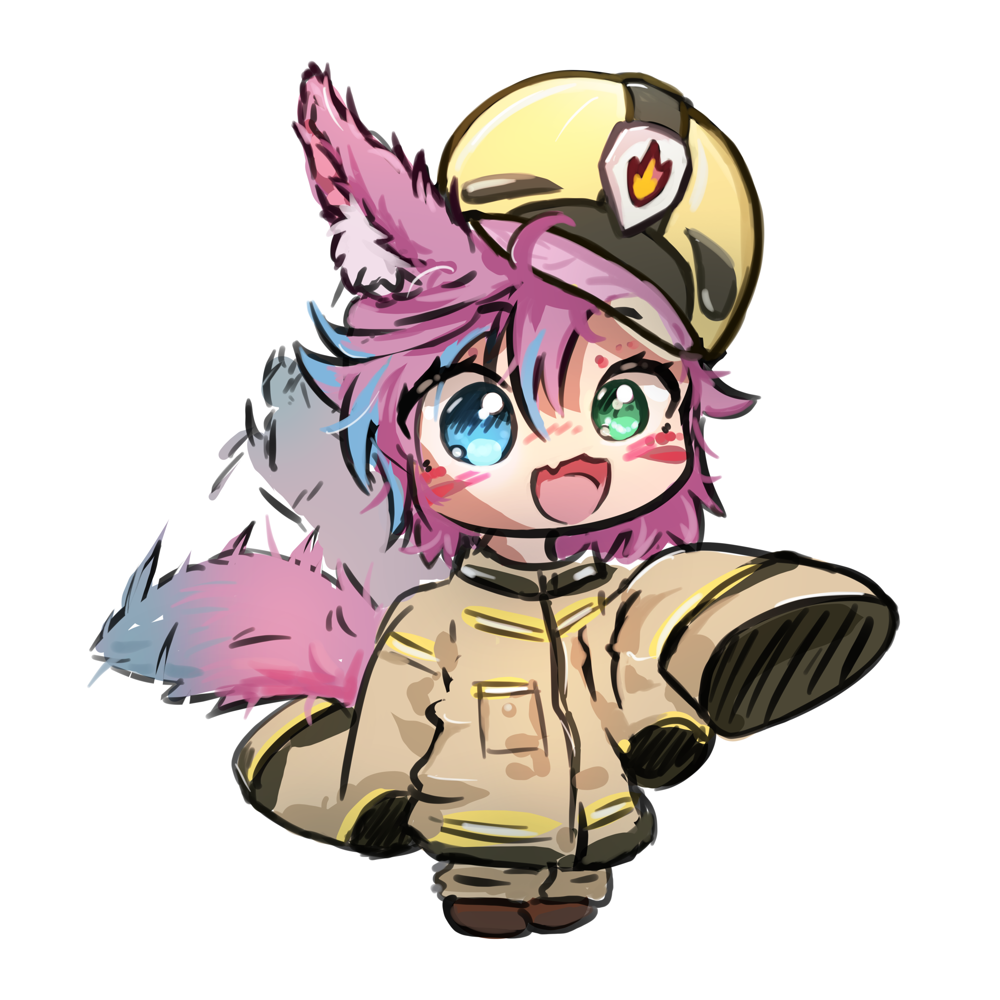

---
hide:
  - navigation
  - toc
---

# Welcome on my page!

{ align=right width="400" }

Hey, I am Chojo.
I work in a Berlin based Data Science company since 2019 as a software/backend developer and lead backend developer
since 2021, which wasn't my initial plan, but actually a good decision.
I first wanted to become a game programmer, but in the end I didn't really follow this path to the end.
Beside my work I also program a lot of other stuff I present on this page.

You will find a lot of stuff on this page.
More information about [myself](about_me/index.md) and how I got where I am or the
[languages and technologies](about_me/technologies.md) I use.
Or maybe you want to read something about my [minecraft](minecraft/index.md) projects, the 
[discord bots](discord/index.md) I developed or the [libraries](libraries/index.md) I maintain.
I also have some [other](more/index.md) projects I work on, which do not fit in any of those categories.

**All the work you can find on my pages is available for free.
If you want to support my work consider subscribing on my [Patreon](https://www.patreon.com/eldoriaplugins) or sponsor
me on [GitHub](https://github.com/rainbowdashlabs)**

Have fun exploring my little page c:

If you want to contact me you can do this via `mail [at] chojo [dot] dev` or via my Discord Server.

There is also a dedicated discord for my Minecraft plugins

